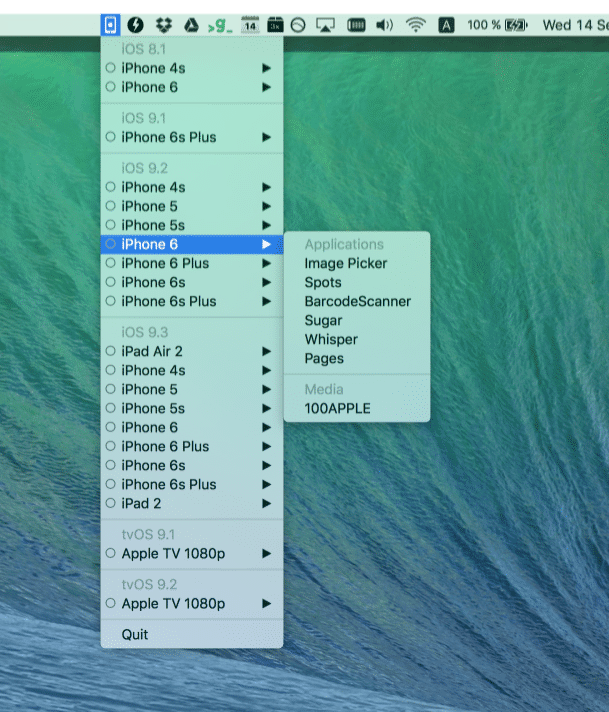

# Simulator

## Export

- Go to `Product -> Archive`
- Choose `Export -> Export as a Mac Application`

## Author

Hyper Interaktiv AS, ios@hyper.no

## License

**Simulator** is available under the MIT license. See the LICENSE file for more info.

